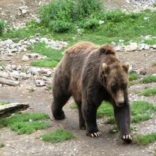
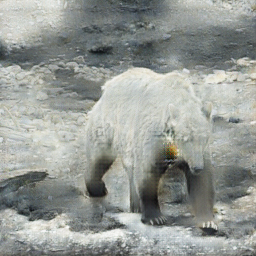
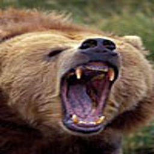
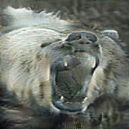

# brownbear2polarbear
Experiment using CycleGAN for Image to Image translation on images of brown bears and polar bears.

Please note that the model does **NOT** create accurate output, this is most likely due to the training data.

</img> </img>
</img> </img>

## Setup for using with your own images
1. Create a folder in your google drive named `Colab Notebooks` (if it does not already exist)
2. Create a folder inside Colab Notebooks called `brownbear2polarbear`
3. Create a .zip archive called "testA" containing a folder called "testA" containing images of brown bears you would like to transform.
4. Place this .zip archive inside the folder `brownbear2polarbear` that we created in step 2.
5. Copy the folder `brownbear2polarbear_checkpoint` to your google drive (inside `Colab Notebooks`, not `brownbear2polarbear`).
6. Now you should be ready to open `brownbear2polarbear_cyclegan_only_run_tests.ipynb` in CoLab and run it.
7. After running, the results should be stored in `brownbear2polarbear_results`, along with a copy in a folder labeled after the date and time of completing the run.

## Copyright
All images are taken with permission for non-commercial and educational use from ImageNet.